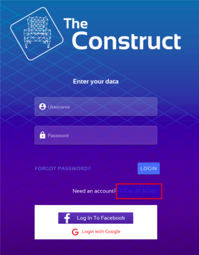
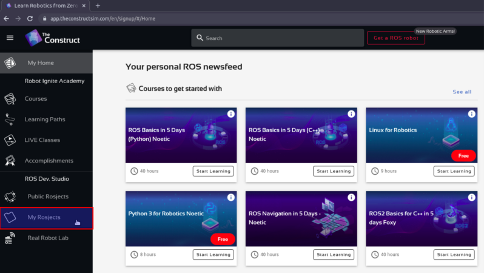
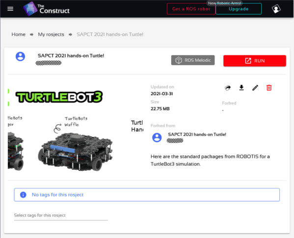

# SAPCT 2021 TurtleBot3 hands-on!

Olá! Este README contém informações para a criação do ambiente virtual que utilizaremos neste mini-curso.

:rotating_light: É importante que você tente realizar todos estes passos antes do dia do mini-curso, para que tenhamos tempo de sobra. O hands-on já começou!

### A plataforma [The Construct](https://app.theconstructsim.com/#/)

Com o intuito de uniformizar a matéria-prima deste curso, escolhemos utilizar a plataforma _web_ [The Construct](https://app.theconstructsim.com/#/). Por meio dela será possível fazer uso dos recursos computacionais necessários de uma forma mais independente do hardware no seu computador e do sistema operacional em uso, sendo necessária apenas a criação de uma conta e a realização do _fork_ do _ROSject_ que utilizaremos. Vamos por partes.

### Criação da conta

É muito simples; escolha "SIGN UP NOW!", preencha os campos que aparecem e a conta está pronta!

Logo em seguida você vai ter acesso a ao espaço do usuário, com várias informações.

:rotating_light: O The Construct envia um e-mail com um link para a confirmação do cadastro. É uma boa ideia realizar isso o quanto antes, ou você ficará impedido de realizar o login até que confirme!

### O espaço do usuário

Para irmos direto ao ponto, a parte mais importante do espaço do usuário que vai aparecer é uma aba chamada "My ROSjects". Lá ficarão os seus projetos, inclusive o que compartilharemos.

O compartilhamento do nosso projeto vai se dar por meio de um _fork_ ("bifurcação"), que nada mais é que fazer uma cópia do ROSject criado para o mini-curso para a sua conta, ficando disponível então *nos seus ROSjects* e apenas você terá acesso (a menos que decida compartilhar com outras pessoas).
Para realizar o _fork_, tudo que você tem que fazer é abrir o link **que será disponibilizado no dia do mini-curso**. Ao abrir, uma tela similar a essa deve aparecer:

A partir daí, basta clicar em "RUN" e o ambiente será preparado na sua conta no The Construct!

---

### Esclarecimentos finais

Apesar do ambiente The Construct ser baseado em web, lidaremos com uma virtualização do sistema operacional **Linux**. Dessa forma, o uso do terminal será constante durante a preparação do *workspace* bem como na simulação do robô.